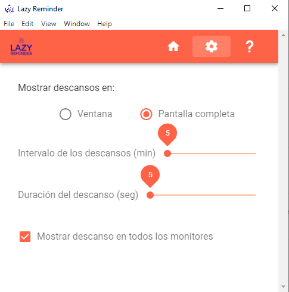
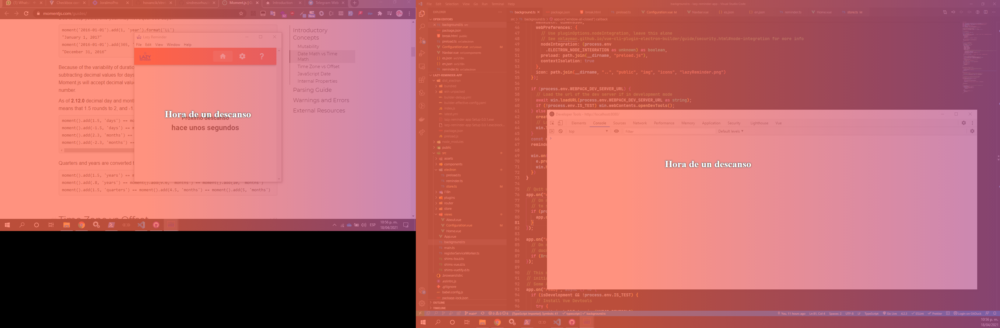

# Electron + Vue with vuetify

## Project setup
```
npm install
```

### Compiles and hot-reloads for development
```
npm run electron:serve
```

### Imágenes





#### inspirada en [stretchly](https://github.com/hovancik/stretchly)